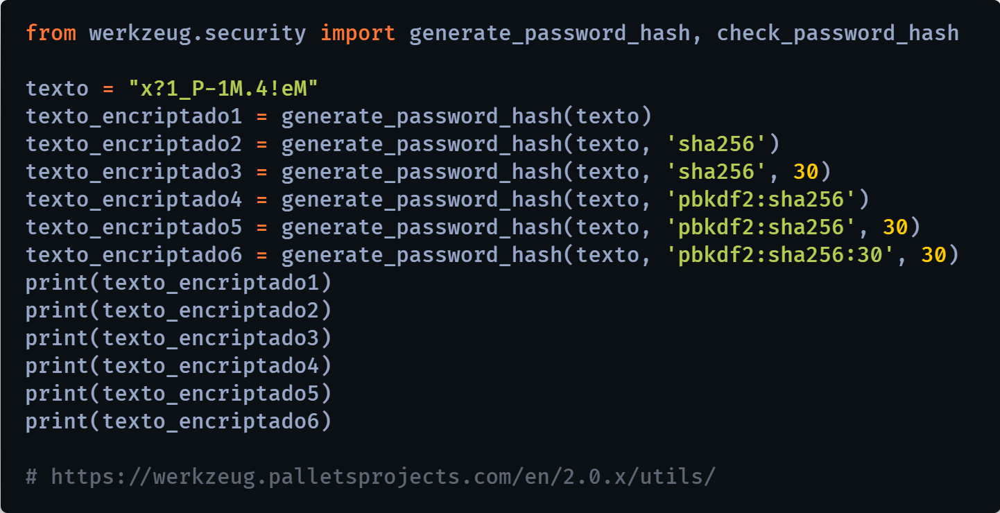
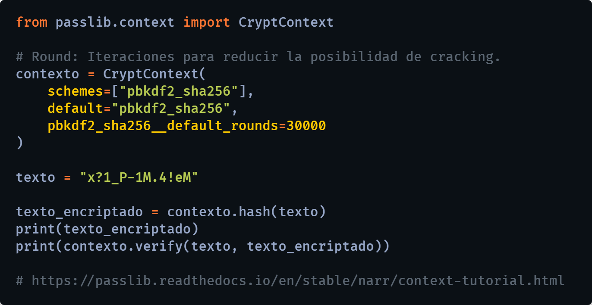
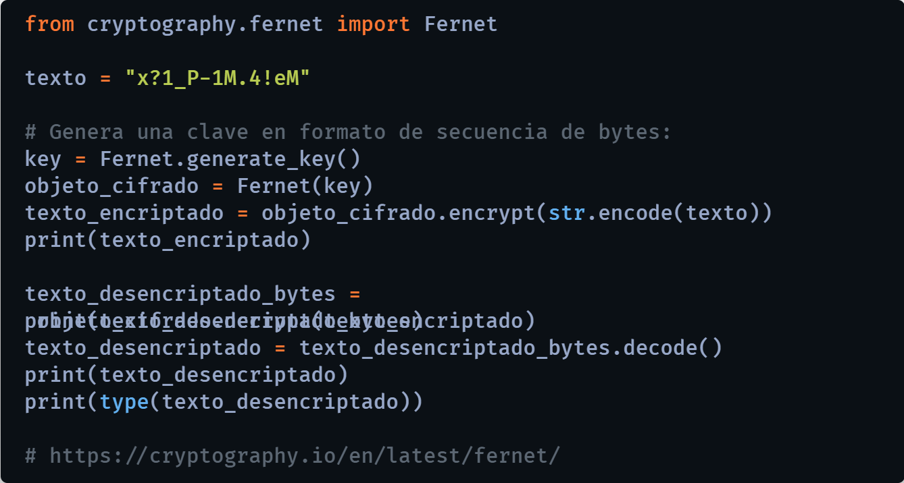

# Encriptación (cifrado) de Contraseñas con Python

Tutorial para la encriptación (cifrado) y desencriptación de contraseñas o textos alfanuméricos con Python.

  

  

# 🌍 Por si deseas contactarme 👨‍💻 :

